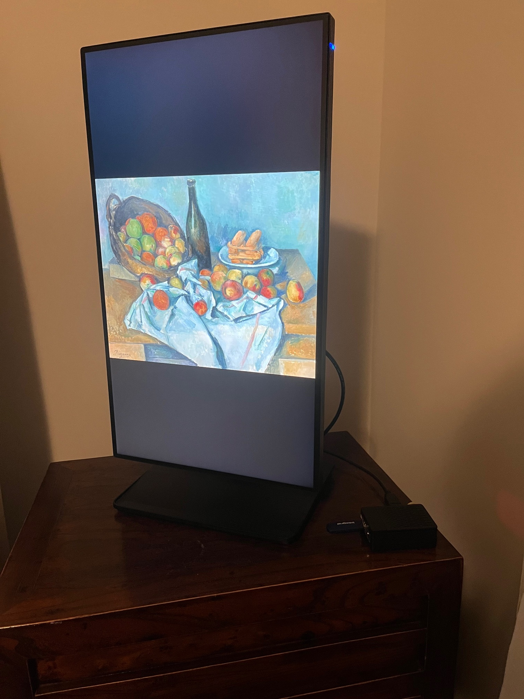
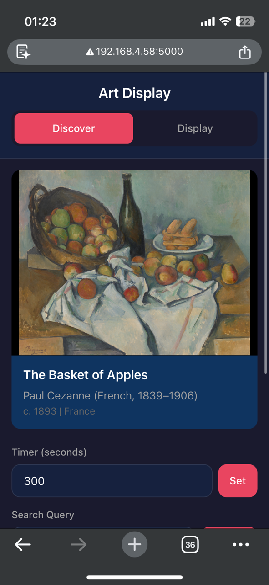
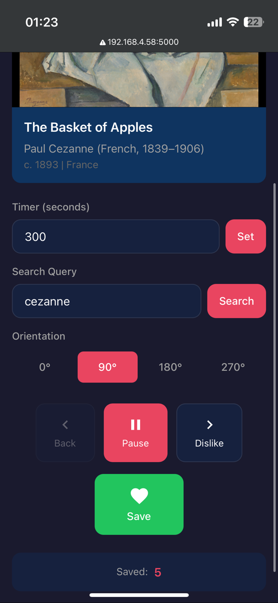

### Artsy

This is a project idea I have had for a while... finally got around to building it with the help of Claude code. It only took a few prompts and some minor tweaking.

The idea is you connect a raspberry pi to an extra monitor you have lying around and the app lets you discover and save art using an art collection api (Chicago Art Institute in this case). There is also a web UI to control the app (skip/save/search/etc.)

More info coming soon...

